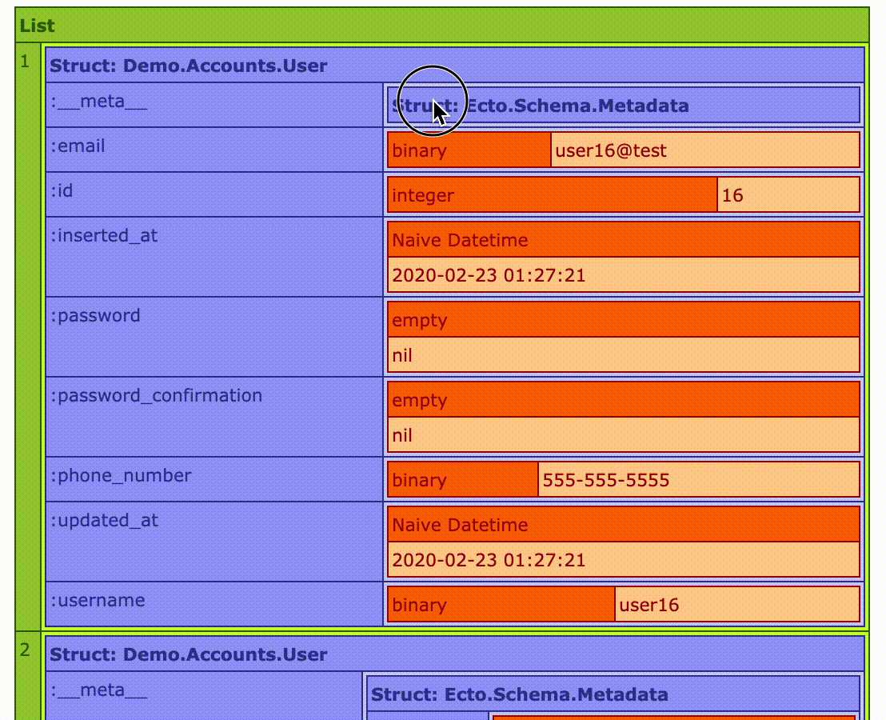

# ExDump

Helper utility for dumping variables in EEx templates for easy inspection.

## Usage

```elixir
<%= ExDump.dump(%{foo: "I'm the map, I'm the map"}) %>
```



## Installation

If [available in Hex](https://hex.pm/docs/publish), the package can be installed
by adding `ex_dump` to your list of dependencies in `mix.exs`:

```elixir
def deps do
  [
    {:ex_dump, "~> 0.2.0"}
  ]
end
```

Documentation can be generated with [ExDoc](https://github.com/elixir-lang/ex_doc)
and published on [HexDocs](https://hexdocs.pm). Once published, the docs can
be found at [https://hexdocs.pm/ex_dump](https://hexdocs.pm/ex_dump).

